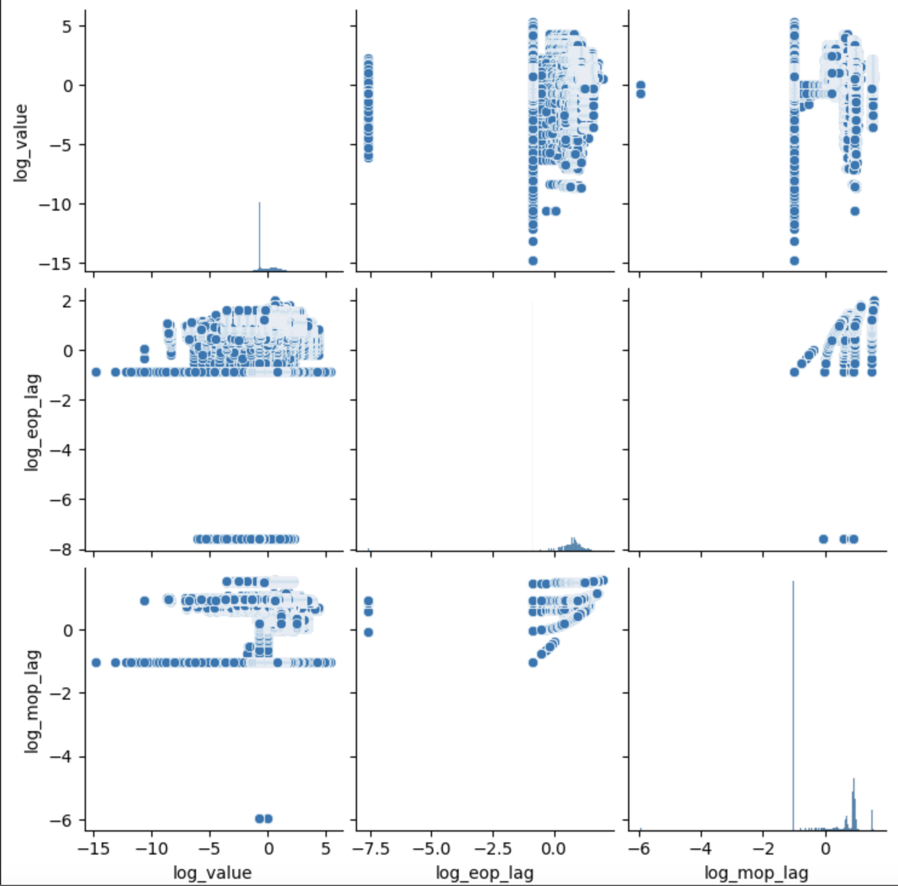
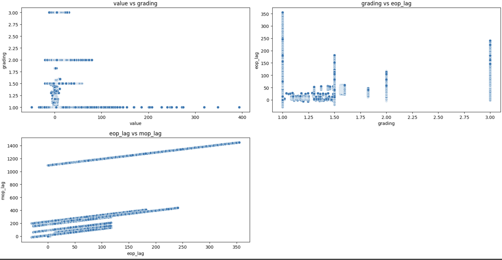
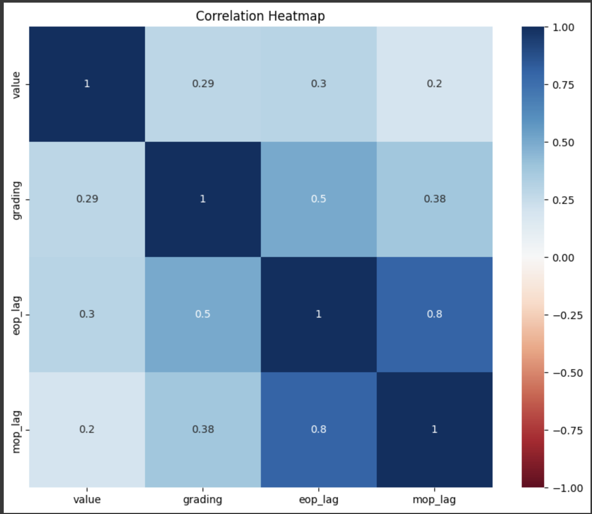

# Portfolio Optimization

## Links to our Milestones:

- [Milestone 2](https://colab.research.google.com/drive/19GPu_rviNHSLKBmy_38112gOe7dZswtD?usp=sharing)
- [Milestone 3](https://colab.research.google.com/drive/1Qv0hLxtsABuNxYEbuCjefbLN4LSL-cEM?usp=sharing)
- [Milestone 4](https://colab.research.google.com/drive/1tB9dCcUKbNccw_W-pJ-Hq5x6bXn_b3Zb?usp=sharing)

Link to Dataset: [Kaggle Dataset](https://www.kaggle.com/datasets/macrosynergy/fixed-income-returns-and-macro-trends)

## Introduction

In the evolving world of finance, the most desirable skills are the ability to predict market trends and optimize portfolios. Our group's vision for this project is to leverage the knowledge we learned about machine learning to enhance such predictive accuracy through a dataset containing financial metrics. As a result, we are hoping to develop models that can offer valuable improvements to the decision-making process in portfolio management.

We chose this dataset because it offers an extremely detailed analysis of financial performance indicators such as returns, macro trends, and lagged values that include data from more than 20 major markets from 2000 to 2022. The dataset contains quantamental indicators which are a combination of quantitative and qualitative data for trading strategies and also includes economic indicators such as GDP growth trends, price inflation trends, and more. In conclusion, the completeness of the data allows us to uncover intrinsic patterns that aren't apparent.

We found this project extremely interesting due to the combination of machine learning aspects and real-world applications it provides. By developing these predictive models, we not only deepen our understanding of machine learning, but also provide potential opportunities to grow financially ourselves in the process of becoming financially independent.

We strongly believe that creating a good predictive model is the most important factor in predictive finance. A well-coded model can help investors identify opportunities for profit, effectively manage potential risks, and overall contribute to making better-informed decisions. In the context of our financial community, this implies more stable markets and better economic opportunities for its citizens. An accurate model can also help mitigate financial meltdowns and crises by allowing the finance world to react timely, which can contribute to significant and continued economic growth.

## What Our Project Did

Our project focused on developing and evaluating machine learning models to predict financial returns and optimize a portfolio. We used a historical financial dataset containing various economic indicators and returns. The main objectives were:

1. **Data Exploration:** Understand the structure, characteristics, and relationships within the data.
2. **Preprocessing:** Clean and prepare the data for modeling by handling missing values, encoding categorical variables, and scaling numerical features.
3. **Model Development:** Implement three different models (Linear Regression, Ridge Regression, and Random Forest Regressor) to predict returns.
4. **Model Evaluation:** Assess the performance of each model using metrics such as Mean Squared Error (MSE) and R-squared (R²) scores, and compare their ability to generalize to unseen data.
5. **Improvement:** Tune hyperparameters and explore advanced techniques to improve model performance and reduce overfitting.

### Accomplishments

- **Developed Multiple Models:** Successfully implemented and evaluated Linear Regression, Ridge Regression, and Random Forest Regressor models.
- **Insightful Comparisons:** Conducted thorough comparisons of model performances, identifying strengths and weaknesses of each approach.
- **Feature Importance:** Analyzed feature importance in the Random Forest model, providing insights into which economic indicators were most influential in predicting returns.
- **Addressed Overfitting:** Identified overfitting issues and took steps to mitigate them, such as hyperparameter tuning and considering more advanced models.
- **Future Directions:** Outlined potential future work, including the use of reinforcement learning and advanced ensemble methods for further improvement.

## Methods

### Data Exploration

Link to Data Exploration Notebook: [Data Exploration Notebook](notebooks/Data_Exploration.ipynb)

In the data exploration phase, we converted our CSV file to a DataFrame and examined the data for missing values, data types, and overall structure. Initial visualizations helped us understand the relationships between different features and returns.

**Code Snippet: Checking for null values, feature types, and correlation heatmap/pairplot visualization.**

```
print("\nSummary of the dataset:")
print(df.info())

print("\nDescriptive statistics of the dataset:")
print(df.describe())

print("\nMissing values in the dataset:")
missing_values = df.isnull().sum()
print(missing_values)

```







### Preprocessing

We cleaned the data by handling missing values, encoding categorical variables, and scaling numerical features. This step ensured that the data was in a suitable format for modeling.

**Code Snippet: Filling missing values, encoding categorical variables, and scaling features.**

### Model 1: Linear Regression

Link to Model 1 Notebook: [Linear Regression Notebook](notebooks/Linear_Regression.ipynb)

Our first model was a Linear Regression model. We performed feature expansion and used a polynomial degree of 2 to capture non-linear relationships. The model showed a high R² value, indicating overfitting.

**Code Snippet: Linear Regression model implementation with feature expansion.**

### Model 2: Ridge Regression

Link to Model 2 Notebook: [Ridge Regression Notebook](notebooks/Ridge_Regression.ipynb)

Our second model was a Ridge Regression model, which added regularization to the Linear Regression to prevent overfitting. The model performed better but still showed signs of overfitting.

**Code Snippet: Ridge Regression model implementation with feature expansion and regularization.**

### Model 3: Random Forest Regressor

Link to Model 3 Notebook: [Random Forest Notebook](notebooks/Random_Forest.ipynb)

Our third model was a Random Forest Regressor, a non-linear model that combines several decision trees to capture complex relationships in the data. Initial results showed signs of overfitting, but hyperparameter tuning improved the model's performance.

**Code Snippet: Random Forest Regressor model implementation and hyperparameter tuning.**

## Results

### Linear Regression

- Training MSE: 2.6444872105683483e-31
- Test MSE: 1.1537005234208904e-31
- Training R²: 1.0
- Test R²: 1.0

### Ridge Regression

- Training MSE: 1.453966772964182e-05
- Test MSE: 1.4214579694990766e-05
- Training R²: 0.9999533961393585
- Test R²: 0.9999530193010754

### Random Forest Regressor

- Training MSE: 0.0015991635940493449
- Test MSE: 0.0038223955048743608
- Training R²: 0.9932320517075023
- Test R²: 0.9808777373054388
- Cross-Validation R² Scores: [-2.78935438, 0.28107945, 0.84705524, -0.49929551, -0.19701962]
- Mean Cross-Validation R²: -0.4715069631131919

### Improved Random Forest Regressor

- Training MSE: 0.0014175949461399484
- Test MSE: 0.003910450525903866
- Training R²: 0.9940004829206452
- Test R²: 0.9804372252648731
- Cross-Validation R² Scores: [-2.64822255, 0.2695247, 0.86733604, -0.49947904, -0.18997028]
- Mean Cross-Validation R²: -0.4401622252770364

## Milestone 2: Data Preprocessing. 

Missing Values Handling: The dataset was checked for missing values and discovered to be free of them. This is a good circumstance because it streamlines the preprocessing stages. However, it is critical to routinely check for missing values, especially after applying transformations or integrating additional datasets, to ensure data integrity is maintained throughout the research.

Remove Unnecessary Columns: The 'Unnamed: 0' column has been identified as an index column with no analytical value. Removing such redundant columns is critical since it reduces the complexity of the dataset and directs the analysis to more significant aspects.


Data Type Conversions: Data type consistency is critical for accurate analysis. The'real_date' column will be transformed to datetime format to aid in time series analysis. Furthermore, all numerical columns must be properly cast as float or integer types. This step helps to prevent type-related errors during analysis and modeling.

Handling Skewed Distributions: The dataset contains several numerical columns with skewed distributions, including 'value', 'eop_lag', and'mop_lag'. To reduce the skewness, a log transformation will be done. This transformation, which was already studied during the data exploration phase, aids in normalizing the data, improving the performance of many statistical and machine learning models that assume normally distributed data.

Scaling Numerical Features: Standardizing numerical features is critical for ensuring that all characteristics contribute equally during the modeling process. This will be accomplished with the 'StandardScaler', which scales the features to a mean of zero and a standard deviation of one. This step was partially handled during the log transformation of skewed columns and will be expanded to include other significant numerical aspects as well.

Handling Categorical variables, such as 'cid' and 'xcat', must be encoded in a numerical format in order to be employed successfully in machine learning methods. Depending on the modeling technique, one-hot or label encoding will be used. One-hot encoding is often chosen for categorical variables without an ordinal relationship because it prevents the algorithm from assuming an inherent order in the categories.

Feature: Feature entails adding new features from current data to improve the model's prediction potential. Time-based elements like year, month, and quarter will be derived from the'real_date' column to capture seasonal trends and patterns. If the variables are considered to have non-linear correlations, interaction terms or polynomial characteristics can be derived.

Outlier Detection and Treatment: Outliers can have a major impact on model performance, particularly for those that are sensitive to data scale. Outliers will be identified and treated using techniques such as the Interquartile Range (IQR), Z-scores, and more complex methods such as isolation forests. Depending on their impact, outliers can be deleted or changed to reduce their influence.

Splitting the Dataset: To evaluate a model, it is necessary to measure performance on previously unseen data. As a result, the dataset will be divided into training and testing sets using 'train_test_split'. A common split ratio is 70-80% training, 20-30% testing. This split allows the model to be trained on a large chunk of the data while being tested on a distinct sample to assess its generalization abilities.

## Milestone 3: Pre-Processing

### Where does your model fit in the fitting graph? and What are the next models you are thinking of and why?

Question 1:

Linear Regression:The initial excellent R2 values of the Linear Regression model suggested that it was overfitting. This implies that it fits the training data—noise included—too closely, which may result in inadequate generalization to fresh data. This model would be on the right side of the fitting graph, where model complexity is high and overfitting causes the error on test data to start rising.

Ridge Regression:The appropriate range for model complexity is fit by the Ridge Regression model. By penalizing large coefficients, the regularization term helps prevent overfitting and achieve a balance between variance and bias. Good generalization is demonstrated by this model's low MSEs and excellent R2 scores on both test and training sets of data. Ridge Regression would be close to the bottom of the U-shaped curve in the fitting graph, where test and training errors are minimized and optimal model complexity is represented.

To compare the effects of regularization, we employed Ridge Regression and Linear Regression:A baseline for understanding the performance of a basic model in the absence of regularization was provided by linear regression. Its flawless R2 scores demonstrated that it assisted in identifying any overfitting problems.In order to solve the overfitting seen with Linear Regression, Ridge Regression was devised. Ridge Regression penalizes big coefficients, which lowers overfitting and enhances generalization to fresh data by including an L2 regularization factor. This illustrated how crucial regularization is to building a strong prediction model.

Question 2:

Investigating non-linear models, such as the Random Forest Regressor, can be very helpful for portfolio optimization in the following stages. This is the reason why: The Random Forest Regressor to enhance predictive performance, Random Forest is an ensemble learning technique that combines several decision trees. It records intricate interactions and non-linear correlations between features that may be overlooked by linear models. These kinds of associations are common in financial data, thus this can be quite helpful there.Advantages: By averaging several trees, it lessens overfitting and is resistant to noise and outliers in the data. It also offers feature importance metrics, which are helpful for comprehending the underlying causes of predictions, and manages both numerical and categorical characteristics with ease. Comparison with Linear Models: We can assess if incorporating non-linear interactions considerably increases the prediction accuracy and robustness of the portfolio optimization model by contrasting Random Forest's performance with that of the linear models (Linear and Ridge Regression).In situations when there are intricate relationships between the financial indicators, Random Forest may perform better, providing a possibly more accurate and trustworthy model for making decisions.

### Conclusion section: What is the conclusion of your 1st model? What can be done to possibly improve it?

For both the training and test datasets, the Linear Regression model showed flawless R2 values, suggesting a significant level of overfitting. This flawless fit implies that the training data's noise and particular patterns, which are not very generalizable to fresh, unobserved data, were being captured by the model. Many approaches can be taken into consideration in order to enhance the Linear Regression model. Large coefficients can be penalized and overfitting can be decreased by using regularization techniques like Lasso Regression (L1 regularization) and Ridge Regression (L2 regularization). Furthermore, the model can be made simpler and more capable of generalization by limiting the number of features to just those that are most pertinent. Furthermore, overfitting can be lessened by evaluating the model's performance using cross-validation techniques and adjusting the hyperparameters accordingly.

In contrast to Linear Regression, however, the Ridge Regression model offered a more robust and balanced match. For the training and test datasets, it showed low MSE values and good R2 scores. The regularization term's addition reduced overfitting and produced a model that performs well when applied to new data. The robustness and dependability of the model were further validated by the cross-validation scores. Still, there may be room for advancement with the Ridge Regression model. Finding the ideal regularization parameter (alpha) value that reduces error and improves generalization can be accomplished by further fine-tuning it using methods like Grid Search or Random Search. Furthermore, enhancing or adding new features might help the model forecast more accurately by capturing more pertinent data.Exploring ensemble methods such as Random Forest or Gradient Boosting can capture more complex relatio

There are various ways to build on the Ridge Regression model's performance. Using models such as the Random Forest Regressor can aid in identifying non-linear patterns within the data. Model performance can be further improved by experimenting with different regularization strategies, such as ElasticNet, which combines L1 and L2 regularization. Robust and trustworthy predictions for portfolio optimization can be achieved by regularly assessing the performance of the model using cross-validation and modifying the modeling strategy in response to the findings. By following these procedures, we may create a more resilient model that fits the training set of data more accurately and generalizes to new data with greater efficacy, offering more trustworthy insights for portfolio optimization.

## Milestone 4: Final Submission

### Questions

Question  Where does your model fit in the fitting graph?

The Random Forest Regressor model leans toward the overfitting region and fits to the right side of the fitting graph. The high training R2 value (0.9940) and the declining test R2 value (0.9804) make this clear. The model is overfitting because of the fluctuation in the cross-validation R2 scores, which further suggests that the model is not generalizing well across various data subsets.

There is a tendency towards overfitting as the Random Forest Regressor model is positioned more towards the right side of the graph. The extremely high training R2 score of 0.9940, which slightly decreases to 0.9804 for the test R2, and the notable differences in cross-validation R2 values demonstrate this. These indications point to the possibility that the model is underfitting to fresh data and overfitting to the training set. The next models being examined are the XGBoost (Extreme Gradient Boosting) and Gradient Boosting Regressor, based on the performance of the current model. Because it can handle non-linear relationships and interactions well and incorporate regularization to avoid overfitting, the Gradient Boosting Regressor is the model of choice. It constructs trees in a sequential manner, enabling each tree to fix the mistakes of the one before it.XGBoost, an advanced implementation of gradient boosting, is also considered due to its optimization for speed and performance, including regularization terms to control overfitting, making it highly effective in various data science competitions.

### Conclusion 

Overfitting was seen in the Random Forest Regressor, which had a very high training R2 (0.9940) and a poor test R2 (0.9804). The model's inability to generalize effectively across various data subsets is demonstrated by the wide variations in cross-validation R2 scores. This shows that even though the model is capable of capturing intricate non-linear correlations in the training set, it might not function as well in the absence of data.There are multiple ways to enhance the model. First, to determine the ideal parameters for the Random Forest model, a thorough hyperparameter tuning can be carried out using GridSearchCV or RandomizedSearchCV. Second, by using feature engineering, one can produce new features—such as interaction terms, polynomial features, or domain-specific transformations—that more accurately represent the underlying patterns in the data. Third, overfitting can be avoided by using models like XGBoost or Gradient Boosting that include built-in regularization. Fourth, the model's capacity for generalization can be enhanced by utilizing strong cross-validation methods like stratified k-fold to guarantee that it is assessed on a variety of data subsets. Fifth, to improve overall performance, take into account ensemble methods like stacking or blending, which combine the strengths of various models. Finally, adding extra data to the model's training set can aid it.

## Discussion

### Data Exploration

The data exploration phase provided critical insights into the dataset, helping us identify relevant features and potential challenges. Visualizations and initial analyses informed our preprocessing strategies, ensuring that the data was well-prepared for modeling.

### Preprocessing

Effective preprocessing was crucial for cleaning the data and preparing it for modeling. Handling missing values, encoding categorical variables, and scaling numerical features ensured that our models received high-quality input data.

### Model Comparison

We compared three models: Linear Regression, Ridge Regression, and Random Forest Regressor. While the linear models showed overfitting, the Random Forest Regressor captured complex relationships but also exhibited overfitting. Hyperparameter tuning improved the Random Forest model, but further steps are needed to enhance its generalization capability.
## Conclusion

Overfitting was seen in the Random Forest Regressor, which had a very high training R² (0.9940) and a poor test R² (0.9804). The model's inability to generalize effectively across various data subsets is demonstrated by the wide variations in cross-validation R² scores. This shows that even though the model is capable of capturing intricate non-linear correlations in the training set, it might not function as well on unseen data.

There are multiple ways to enhance the model:
- **Hyperparameter Tuning:** Perform extensive hyperparameter tuning using GridSearchCV or RandomizedSearchCV to find the optimal parameters for the Random Forest model.
- **Feature Engineering:** Create new features such as interaction terms, polynomial features, or domain-specific transformations that better capture the underlying patterns in the data.
- **Regularization:** Implement models with built-in regularization like Gradient Boosting or XGBoost to prevent overfitting.
- **Cross-Validation Strategy:** Use robust cross-validation techniques like stratified k-fold to ensure the model is evaluated on diverse data subsets, improving its generalization capability.
- **Ensemble Methods:** Consider using ensemble methods like stacking or blending to combine the strengths of different models, improving overall performance.
- **More Data:** If possible, gather more data to train the model. More data can help the model learn more robust patterns and reduce overfitting.

By implementing these steps, we can build a Random Forest model that generalizes better and provides more reliable predictions for portfolio optimization.

**Future Directions:**
- **Forecasting and Reinforcement Learning:** Use the model for forecasting future returns and implementing reinforcement learning to continuously improve the model based on new data.
- **Advanced Models:** Explore more advanced models and ensemble methods to improve prediction accuracy and robustness.
- **Real-World Application:** Develop a user-friendly application that leverages the model for real-time portfolio optimization, providing actionable insights for investors.

## Statement of Collaboration

**Joseph Whiteman:**
- Contribution: Data exploration, preprocessing, model implementation, and evaluation, writing sections of the report.

**Ben Li:**
- Contribution: Hyperparameter tuning, feature engineering, model evaluation, writing sections of the report.

Both team members collaborated closely throughout the project, providing feedback and ensuring the successful completion of each milestone. The teamwork was instrumental in addressing challenges and refining the models.
